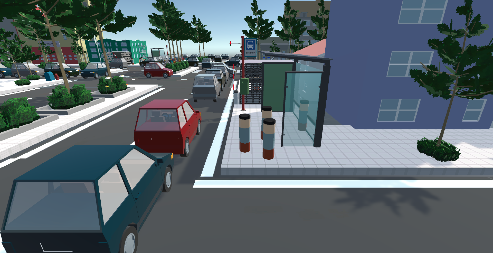

# Bloque-agentes
Esta entrega contiene todas las revisiones

### Pasos para correr el proyecto
Abrir una terminal y correr los siguientes comandos:


```cd /Bloque-agentes/Entrega final reto/SMA```  

```python3 server_flask.py```  

Abrir Unity Hub  

Seleccionar **My project** y darle play

 

 10.28.47 a.m..png)

## Autores

- Erika García [@A01745158](https://github.com/A01745158)
- Gala Flores [@galaflores](https://github.com/galaflores)
- Yunoe Sierra [@YunoeSd](https://github.com/YunoeSd)
- Rodrigo Mendoza [@RodrigoMendoza2000](https://github.com/RodrigoMendoza2000)
- Antonio Oviedo [@oviedo-13](https://github.com/oviedo-13)
